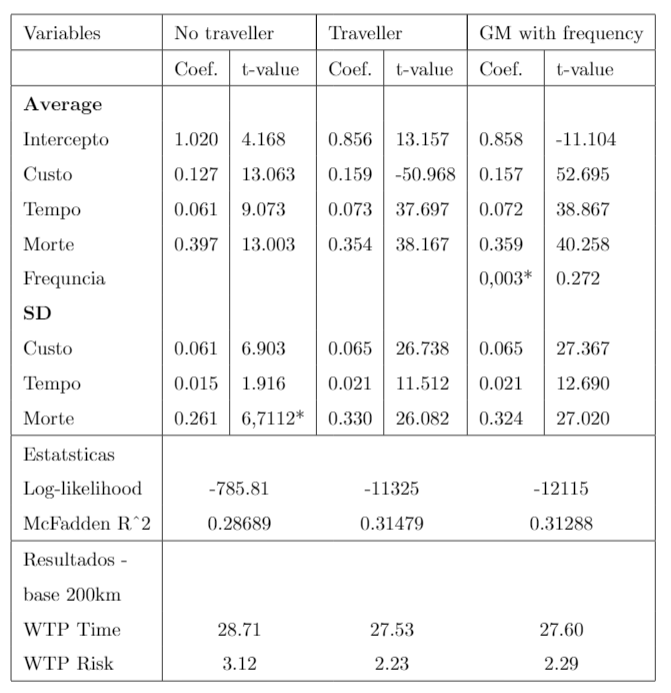
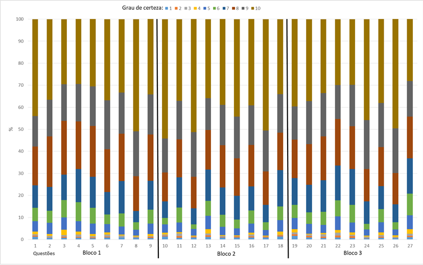
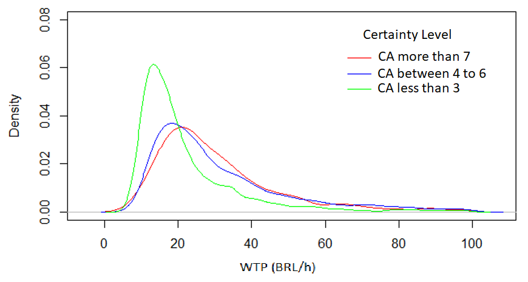
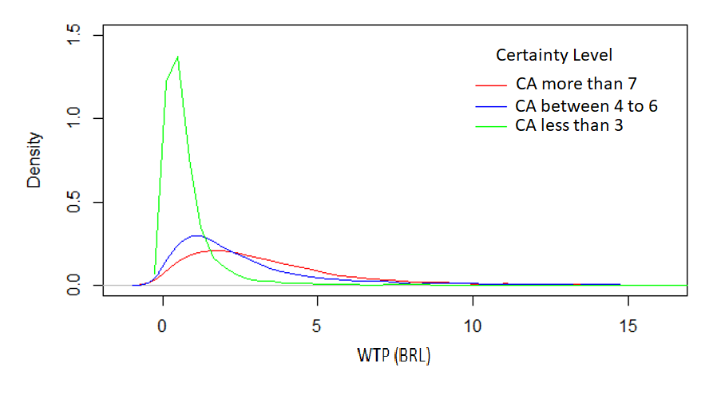
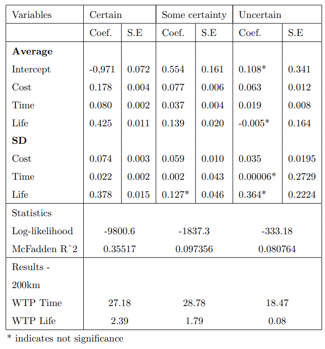
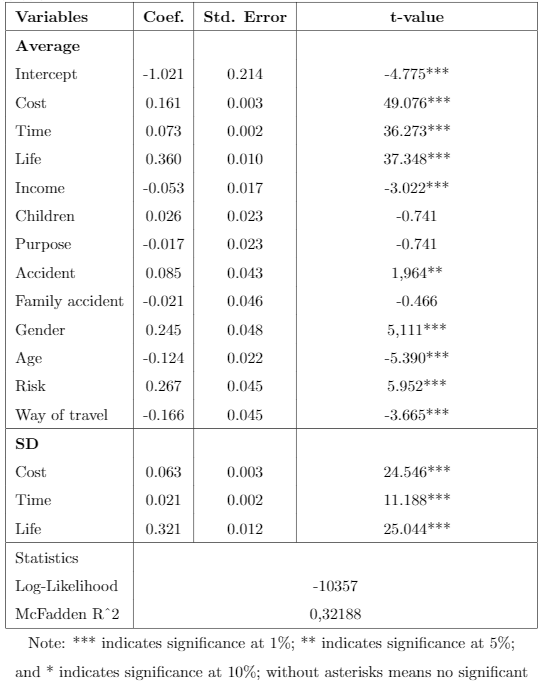
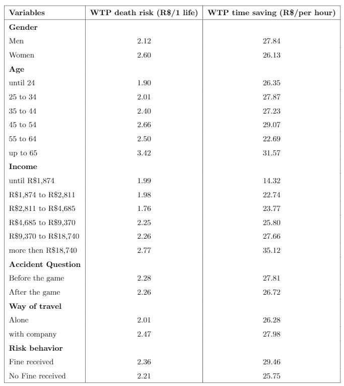

```{r load-packages, include=FALSE}
# Run only if you need to install `WTPBr`
# devtools::install_github("TatianaFerrari/Brazil-Transport-Survey/WTPBr", build_vignettes = TRUE)

library(WTPBr)
library(mlogit)
library(kableExtra)
library(truncnorm)
library(stargazer)
library(gridExtra)
library(pander)
```

```{r load-data, include=FALSE}
 data("mixedlogit")
```

```{r setup, include=FALSE}
knitr::opts_chunk$set(echo = TRUE)
```

Introduction
==========================

Brazil has a road network of about 1.8 million kilometers, being the main means of transportation in the country. However, data from the Highway Survey conducted by the National Transport Confederation (CNT, 2016) show that the general state of Brazilian roads is deficient: only 12.3\% of the roads are paved, 86.6\% are single carriageways and 42.2\% have no shoulder. According to the evaluation carried out by CNT, deficiencies in roads cause high fuel consumption, greater wear and tear on the vehicle fleet, greater occurrence of accidents and environmental damage. In addition, roads with limited capacity and boreholes considerably increase travel time. 

@pompermayer2017simulaccao shows that the average annual expenditures of the National Department of Transportation Infrastructure (DNIT), only with recovery and maintenance of the Brazilian road network, are more than R\$ 8 billion and still insufficient to maintain an acceptable quality standard. 

The scarce resources cause public policy makers to prioritize different investments in road infrastructure. Improvements in the condition of roads can result in important gains in reducing travel time, reducing vehicle costs and maintenance, and reducing the number of fatal accidents. Thus, intervention projects can be justified through cost-benefit analyses. For this, it is necessary to obtain the monetary values of such benefits. 

According to the microeconomic theory of revealed preference, the value of goods and services can be derived by observing the choices made by individuals. However, time and the reduction of the risk of death do not have market value, because they are not tangible and subjective benefits. 

In view of this, the study aims to obtain estimates related to the parameters of time savings value and the value of statistical life for the Brazilian case, in order to subsidize cost-benefit analyses of investment projects in highways, as well as in other projects or policies involving these parameters. The methodology used consisted of survey application to obtain the declared preference (PD) of individuals and the use of the Mixed Multinomial Logit model, of discrete choice, to estimate the willingness to pay (WTP) for these attributes. 

The rest of this paper is organized as follows. Section 2 describes briefly the topics in the survey; Section 3 the methodology adopted for preference analysis; and Section 4 presents the estimation results.

Survey Design
============

## Survey Structure

The survey consists of seven sections, namely: 

(1) Introduction and first set of social-economic data;

(2) Travel habits from last 12 months;

(3)	Last or most frequent trip made by car or motorcycle in Brazilian highways;

(4)	Stated choice experiment;

(5)	Debrief;

(6)	Complementary questions;

(7)	Second set of social-economic data.

One question in particular is worth pointing out: we asked the respondents about their involvement in accidents, or of their relatives. To test if the recollection of a possible/actual accident would influence their choice behavior when answering the experiment we randomized the position of this question: either immediately before or after the experiment.


Methodology
===================

Estimates for the value of travel time savings and of risk of death reduction on roads travels was obtained by applying the discrete choice model. This approach considers that each individual _n_ has a set of alternatives, each having a series of associated characteristics ($x_{nj}$). The individual will choose the alternative that maximizes their utility, account for observable and unobserved factors, so that $U_{ni} > U_{nj}$ for $\forall j\neq i$.: 

$$
U_{nj} = V_{ni} + \epsilon_{ni} = \beta^{'}_{n} X_{nj} + \epsilon_{nj}
$$

where $x_{nj}$ is a vector of observed variables that gives the utility of individual _n_ for the alternative _i_, $\beta_n$ is the correspondent vector of coefficients of variables $x_{nj}$ representing the individual’s tastes, and $\epsilon_{ni}$ is an unobserved random term that represents the effects of omitted variable.

The route choice process of our stated preference experiment allow us to derive the subjective valuations of the attributes, which are called Willingness to Pay (WTP) and expresses the marginal substitution rate between the considered attribute and the cost, given a constant utility. 

Among the different class of models, we find the the mixed logit model more appropriate for modeling our choice data, since it allows the coefficients of the model to have variations between the individuals. According to @train2002discrete, the mixed logit probabilities are the integral of standard logit probabilities over a density of parameters. If the utility is linear in $\beta$, can be expressed as:

\begin{equation}
    P_{ni} = \int \frac{exp(x'_{ni}\beta)}{\sum^J_{j=1}exp(x'_{nj}\beta)}f(\beta|\theta)d\beta
\label{eq:mixed_form}
\end{equation}

where, $x'_{ni}\beta$ are the portion of utility observed, which depends on parameters $\beta$ and $f(\beta|\theta)$ is a density function of $\beta$. In this terms, the mixed logit model is a mixture of a logit function evaluated in different $\beta$'s, with a mixed distribution in $f(\beta|\theta)$.

In the stated preference experiment each respondent has a sequence of route choice (nine times in our particular case). To count all of then it is necessary to take the product of the Equation \ref{eq:mixed_form}:

$$
    S_{n} = \int \prod^T_{t=1} \prod^J_{j=1} \Bigg[\frac{exp(x'_{ni}\beta)}{\sum^J_{j=1}exp(x'_{nj}\beta)}\Bigg]^{y_{njt}}f(\beta|\theta)d\beta
$$

with, $y_{njt}= 1$ if the alternative _j_ was choosen in _t_, and 0 otherwise.

As stated by @hensher2003mixed the choice probability in mixed logit models ``cannot be calculated exactly because the integral does not have a closed form. The integral is approximated through simulation''. The simulated probability (SP) that an individual chooses alternative _i_ could be obtained through the maximization of the likelihood function. In general, this simulation is given by a Halton's sequence. 

\begin{equation}
    SP = \sum^N_{n=1}ln \Big(\frac{1}{R} \sum^R_{r=1} \prod^T_{t=1} \prod^J_{j=1} \Bigg[\frac{exp(x'_{nit}\beta^{[r]}_n)}{\sum^J_{j=1}exp(x'_{njt}\beta^{[r]}_n)}\Bigg]^{y_{njt}} \Big)
\end{equation}

With $\beta^{[r]}_n$ representing the number of drawings (r = number of Halton's draws) for individual _n_ given the assumed distribution by $\beta$.

Thus, three specifications arise with the use of the mixed logit model: 1) select the variables that should be considered as random; 2) the choice of the statistical distribution for the random coefficients; and 3) determine the number of Halton draws for the simulation.

The random variables included in the model are the ones of the stated preference experiment: cost, time and risk of death. The other variables that may be included, as the characteristics of the respondent and  of the travel, are treat as no random. 

The normal distribution is the standard distribution in statistical software and generally applied in mixed logit models. However, @hess2005estimation shows that, since the normal distribution is unbounded, every real number has a probability of being estimated in the simulation process´´. In the case of parameters that have a strictly negative distribution, but has a mean close to zero with a long tail into the negative space of numbers´´, as in the case of time and risk of death reduction, ``the symmetrical nature of the normal distribution can, in approximation, lead to a significant share of positive values, even though such values are not actually revealed by the data´´. 

Hence, the following alternative distributions are tested: lognormal, triangular and normal distribution truncated at zero. The better model fit is obtained by the model using the Normal distribution truncated at zero. In this case,  

\begin{equation}
    \beta_{k,ir} = 
       \begin{cases}
            \beta_k + \omega_kW_{k.ir}, & \mbox{if } \beta_{k_ir} > 0 \\

             0, & \mbox{otherwise.} \\
       \end{cases} 
       W_{k_ir} ~ N(0,1)
\end{equation}

The third specification refers to the number of Halton draws to be considered. The model were tested using different numbers of draws, comparing the efficiency and time of processing. It was observed that after 500 Halton draws the model stabilized, with no significant gains in efficiency with the increase in number of simulations and therefore, this number was established for the model.

Results
===================

## General model
We first approach a general model, considering only the game attributes: cost, time and death. 

Table \ref{resultgeral} presents the estimation of the respondent's preferences according to the mixed logit model, considering the specifications of section 3. The coefficients were significant at 1\% and present the expected sign. It's important to emphasize that the variable's signs were switched due to the truncated distribution adopted previously. Therefore, the positive result for cost, time and death mean an negative impact, that is, when traveling the individuals prefer the route with lowest cost, travel time and death risk.

```{r general, include=FALSE, cache=TRUE}
Hbasic <- mlogit.data(mixedlogit, shape="long", choice="choice", alt.var = "rota", id="id", opposite = c('custo','morte', 'tempo'))

mxl.basic500<- mlogit(choice~custo+morte+tempo, Hbasic, rpar=c(custo='cn', morte='cn', tempo='cn'), R=500, halton=NA, print.level=0, panel=TRUE)
```

```{r resultgeral, echo=FALSE}

stargazer(mxl.basic500, title="General Mixed Logit Result",type = "text",style="qje", single.row = TRUE, covariate.labels = c("Intercept", "Cost", "Life", "Time", "sd.cost", "sd.life", "sd.time"))
```

```{r wtpGeral, echo=FALSE}
wtpresults = data.frame(WTP_200km = c("Time (BRL per hour)", "Life(BRL per 1 death)"),
                        Values = c((coef(mxl.basic500)["tempo"]/coef(mxl.basic500)["custo"])*60, coef(mxl.basic500)["morte"]/coef(mxl.basic500)["custo"]))

kable(wtpresults, 
      digits = 2, 
      align = "c") %>% kable_styling(bootstrap_options = "striped", full_width=FALSE)
```

Considering the baseline distance of 200km, the model estimated a willingness to pay of R\$27,60 for a travel time saving of one hour and R\$2,29 for risk reduction of one death.

The WTP values are random variables with an unknown distribution. With the means and the standard deviation values of the variables, we used a simulation process to estimate the values' distribution for individuals, considering the interval of 0 to 100 Brazilian Reais.

Figure\ref{figure2} presents the distribution for WTP as a Kernel Density. It is concentrated at the beginning of the distribution, where values for WTP are lower. For death risk reduction, 95\% of the distribution is concentrated up to BRL 10, while the WTP for travel time saving seems to be more distributed and with a lengthened tail. However, that occurs only due to the value conversion to value per hour. Therefore, we have a strong concentration of individuals who are willing to pay between BRL 10 and BRL 40 for the reduction of one hour in their travel time.


```{r fig2, echoes=FALSE, include=FALSE}
 cust = rtruncnorm( 3000 , a = 0 , b = Inf , mean = 0.1568735 , sd = 0.0647084)
 mort = rtruncnorm( 3000 , a = 0 , b = Inf , mean = 0.3586975 , sd = 0.3240246)
 temp = rtruncnorm( 3000 , a = 0 , b = Inf , mean = 0.0722171 , sd = 0.0214030)

 razao1 = mort/cust
 razao2 = (temp/cust)*60
``` 
 
```{r figure2, echoes=FALSE}
fig1 <- plot(density( razao1[razao1 < 100] ), col = "red")
 
# Recreate Figure 2
fig2 <- plot(density( razao2[razao2 < 100] ), col = "blue")

# grid.arrange(fig1, fig2, ncol = 2)
```


One of the factors that can influence the individual's perception of the value they're willing to pay is if they are - or are not - road users. As stated by @sen1993internal, information access can considerably change individual's choice behaviour. Our survey informs respondents about travel conditions as travel time and number of deaths by road accidents, while also reminding them of their personal travel experience, as to give context and therefore improve their perception when answering the game. Nevertheless, we allowed all participants to respond to the game, frequent travelers or not, who have travelled on roads in the last 12 months, as well as the ones who didn't.

As observed in Table \ref{table-simple}, there was a clear difference in perception of users and non-users of roads. The ones who hadn't traveled in the past 12 months had a WTP for reducing death risk significantly higher than the ones who did travel, being willing to pay R\$0,90 more.

For travel time savings, it is interesting to notice that non-user individuals had similar preferences, with the variable's standard deviation being not significant, that is, the importance of time was homogeneous between individuals of the stratum. The willingness to pay, as with the previous parameter, was superior to the one of users.

This behaviour might be explained by difference in the amount of knowledge and access to information that users and non-users have. Non-users might have used their urban area commute experience as a reference. Also, they don't have knowledge about other incurred travel costs, road conditions and other aspects that might alter their perception to the point of being willing to pay higher prices for reduction of travel time and of death risk. 




Finally, in this general analysis, we estimated the WTP of respondents according to the degree of certainty with which they answered the game. The calibration through the certainty approach allows us to remove some behavioural deviance inherent to the stated preference method. Since we are applying a monetary value to an intangible good, that is, which doesn't have a market value, the respondent might not be acquainted with the object of choice and therefore have some difficulties when evaluating their preferences for these goods.

The purpose of this approach is to exclude answers in which there was a considerable amount of uncertainty declared. However, the literature shows that there is no consensus regarding the acceptable degree of certainty, as the review carried out by @beck2016can verified: several studies use 8 and others use 7 as a threshold, amongst other values.

Graphic 1 shows the pattern of answer certainty (CA) for each question of the experiment. Most answers had a high level of certainty. Grades from 7 to 10 summed over 80\% of answers in most questions. The ones with a higher level of uncertainty, that is, more than 15\% of grades under 7 (items: 3, 4, 13, 18, 19, 22, 23 and 27) are the ones with highest value for toll (R\$40).



We separated the answers into three groups based on the declared degree of certainty: Certain - CA from 7 to 10; Some certainty - CA from 4 to 6; Uncertain - CA up to 3.

The results of the mixed logit model estimation for each CA group is presented on Table. Graphics and shows the Kernel Density for risk of death reduction and travel time savings respectively.

We can observe that there is a significant variation in answer patterns when considering the respondents certainty of choice. The results, in addition, show that when the answer was made with uncertainty, the estimations for the parameters of death, time and their respective standard deviations weren't significant at 10\%. Notice that choices made with certainty provided a higher value to death risk reduction and, as the trade-off with cost became closer to the threshold (higher prices), the level of certainty decreased.

This trade-off can easily be observed in the Kernel Density graphs (Table and. The curve of uncertain answers is concentrated in lower values of WTP while the certain answers is better distributed. In contrast, the curve of uncertain choice also presents a distribution with a tail with greater length. This pattern shows that the uncertainty was generated in cases when the individual did not accept to pay a higher price for improvement, but was not confident to renounce the benefits, or that he agreed to pay the higher price for improvements but disapproved the value proposed.







## EXPANDED MODEL

The expanded model was estimated to observe the systematic heterogeneity of preferences, which can occur due to different socioeconomic characteristics or to different travel behaviour from each respondent.
Thus, we added the following characteristics to the general model:

    1. Household Income
    2. Number of children
    3. Trip Purpose
    4. Traffic accident question`s position in questionnaire
    5. Occurrence of traffic accident in last 5 years
    6. Gender
    7. Age group
    8. If committed any traffic infractions
    9. If the respondent imagined himself as being alone or with company.

From the items listed above, numbers 2, 3 and 5 did not present statistical significance at the level of 90\%, that is, they do not influence the respondents` preferences when making a choice between routes A and B, as shown in Table. All other characteristics were significant at 99\%, except for the position of the accident question, which was significant at 95\%.



Table   shows the WTP values calculated for each characteristic with significance equal to or higher than 95\%. Female respondents declared to be willing to pay considerably more for safety than male subjects, in contrast to the WTP for time savings, which was more valued by the male respondents, except with a smaller disparity.



For safety as for time savings, the age group and income group are proportional to he willingness to pay, as expected. That is, the older and the better financial conditions, the higher the willingness to pay. It is also higher when the respondent imagined himself traveling accompanied. In this case, the subject probably considered dividing the toll cost between driver and passengers or considered that the benefits are multiplied by the number of occupants in the car.

The respondents who received a fine for any kind of traffic infraction in the last 12 months were classified as having risky behaviour, also known as Risk Lovers. As expected, they are willing to pay higher prices to reduce travel time and to reduce risk than respondents who didn't present such behaviour.


References {#references .unnumbered}
==========
